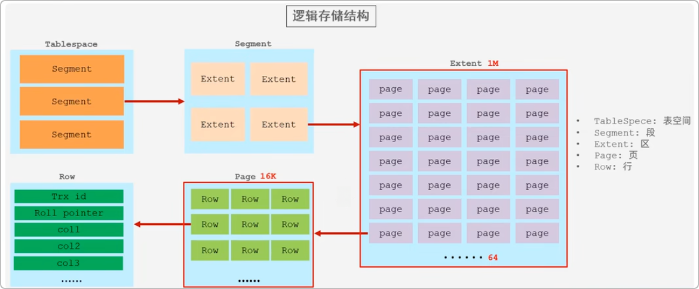
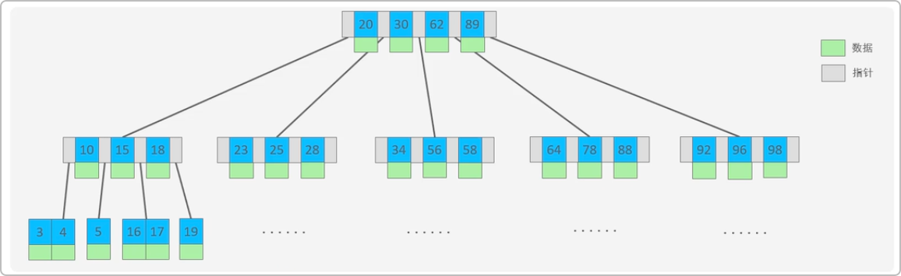
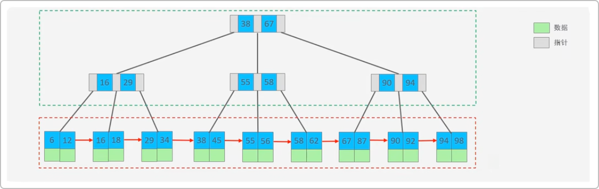
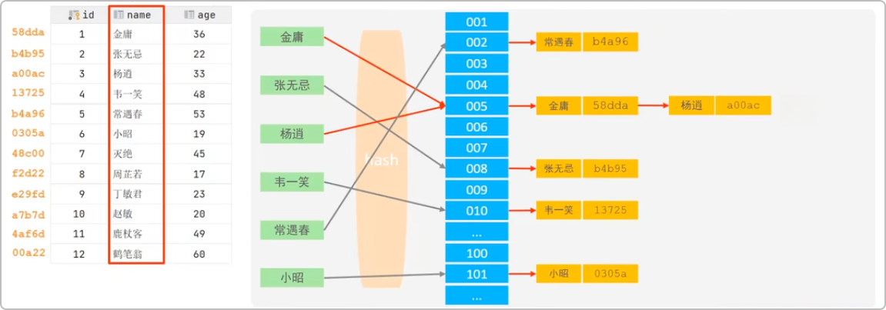
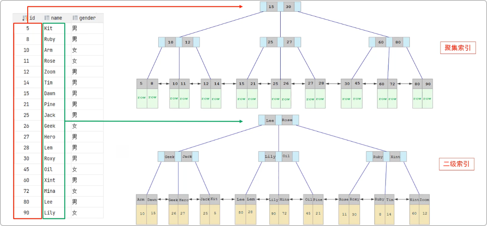
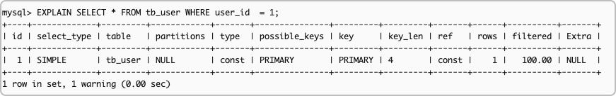
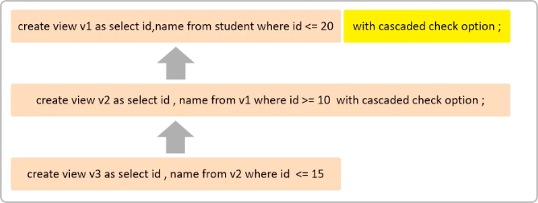
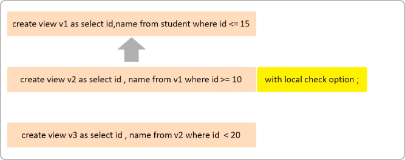

# Mysql Advanced Study

## 存储引擎

### MySQL体系结构

#### 连接层

最上层是一些客户端和连接服务，主要完成一些类似于连接处理、授权认证及相关的安全方案。服务器也会为安钱接入的每个客户端验证它所具有的权限。

#### 服务层 

第二层架构主要完成大多数的核型服务功能，如SQL接口，并完成缓存的查询，SQL的分析和优化，部分内置函数的执行。所有跨存储引擎的功能也在这一层实现，如过程、函数等。

#### 引擎层

存储引擎真正的负责了MySQL中数据的存储和提取，服务器通过API和存储引擎进行通信。不同的存储引擎具有不同的功能，这样我们可以根据自己的需要，来选取合适的存储引擎。

#### 存储层

主要是将数据存储在文件系统之上，并完成与存储引擎的交互。

###  存储引擎简介

存储引擎就是存储数据、建立索引、更新/查询数据等技术等实现方式。存储引擎是基于表等，而不是基于库等，所以存储引擎也可被称为表类型。

MySQL的默认的存储引擎是 InnoDB

```sql
-- 在创建表的时候，指定存储引擎
CREATE TABLE table_name(
		column_1 column_type_1 [COMMIT 'xxx'],
  	...
  	column_n column_type_n [COMMIT 'xxx']
) ENGINE = INNODB [COMMIT 'xxx'];

-- 查看当前数据库支持的存储引擎
SHOW ENGINES;
```

### 存储引擎特点

#### InnoDB

##### 介绍

`InnoDB` 是一种兼顾高可靠性和高性能的通用存储引擎，在 `MySQL 5.5 ` 之后，`InnoDB` 是默认的 `MySQL` 存储引擎。

##### 特点

- `DML` 操作遵循 `ACID` 模型，支持事务；
- 行级锁，提高并发访问性能；
- 支持外键 `FOREIGN KEY` 约束，保证数据的完整性和正确性。

##### 文件

- `xxx.ibd`：xxx代表的是表名，`InnoDB` 引擎的每张表都会对应这样一个表空间文件，存储该表的结构(frm、sdi)、数据和索引。

- **参数**：innodb_file_per_table

```sql
-- 查看 表空间文件 是否 打开
SHOW VARIABLES LIKE 'innodb_file_per_table';
```

##### 逻辑存储结构



#### MyISAM

##### 介绍

`MyISAM`是 `MySQL` 早期的默认存储引擎。

##### 特点

- 不支持事务，不支持外键。
- 支持表锁，不支持行锁。
- 访问熟读快。

##### 文件

-  `xxx.sdi`: 存储表的结构信息。
- `xxx.MYD`: 存储数据
- `xxx.MYI`: 存储索引

#### Memory

##### 介绍

`Memory` 引擎的表数据时存储在内存中，由于受到硬件问题或断电问题的影响，只能将这些表作为临时表或缓存使用。

##### 特点

- 内存存放，访问速度快 
- hash索引（默认）

##### 文件

- `xxx.sdi`: 存储表结构信息。

#### 三种存储引擎的区别

|    特点    |   InnoDB    | MyISAM | Memory |
|:--------:|:-----------:|:------:|:------:|
|   存储限制   |    64TB     |   有    |   有    |
|   事务安全   |     支持      |   -    |   -    |
|   锁机制    |     行锁      |   表锁   |   表锁   |
| B+tree索引 |     支持      |   支持   |   支持   |
|  Hash索引  |      -      |   -    |   支持   |
|   全文索引   | 支持(5.6版本之后) |   支持   |   -    |
|   空间使用   |      高      |   低    |  N/A   |
|   内存使用   |      高      |   低    |   中等   |
|  批量插入速度  |      低      |   高    |   高    |
|   支持外键   |     支持      |   -    |   -    |

### 存储引擎选择

**在选择存储引擎时，应该根据应用系统的特点选择合适的存储引擎。对于复杂的应用系统，还可以根据实际情况选择多种存储引擎进行组合。**

- `InnoDB`：是`MySQL` 的默认存储引擎，支持事务、外键。如果应用对事务的完整性有比较高的要求，在并发条件下要求数据的一致性，数据操作除了插入和查询之外，还包含很多的更新、删除操作，那么`InnoDB`存储引擎是比较合适的选择。
- `MyISAM`: 如果应用是以读操作和插入操作为主，只有很少的更新操作，并且对事务的完整性、并发性要求不是很高，那么选择这个存储引擎是非常合适的。
- `Memory`: 将所有数据保存在内存中，访问速度快，通常用于临时表及缓存。`Memory` 的缺陷就是对表的大小有限制，太大的表无法缓存在内存中，而且无法保障数据的安全性。

## 索引

### 索引概述

#### 介绍

索引(`index`) 是帮助`mysql` **高效获取数据**的**数据结构（有序）**。在数据之外，数据库系统还维护着满足特定查找算法的数据结构，这些数据结构以某种方式引用（指向）数据，这样就可以在这些数据结构上实现高级查找算法，这种数据结构就是索引。

#### 优缺点

|                优势                |                               劣势                                |
|:--------------------------------:|:---------------------------------------------------------------:|
|      提高数据检索的效率，降低数据库的IO成本。       |                           索引列也是要占空间的。                           |
| 通过索引列对数据进行排序，降低数据排序的成本，降低CPU的消耗。 | 索引大大提高了查询效率，同时却也降低更新表的数据，如对表进行`INSERT`、`UPDATE`、`DELETE`时，效率更低。 |

### 索引结构

`Mysql`的索引是在存储引擎层实现的，不同的存储索引引擎有不同的结构。

|      索引结构       |                     描述                     |  InnoDB   | MyISAM | Memory |
|:---------------:|:------------------------------------------:|:---------:|:------:|:------:|
|    B+Tree 索引    |           最常见的索引类型，大部分引擎都支持B+数索引           |    支持     |   支持   |   支持   |
|     Hash索引      |  底层数据结构是使用哈希表实现的，只有精确匹配索引列的查询才有效，不支持范围查询   |    不支持    |  不支持   |   支持   |
|  R-tree(空间索引)   | 空间索引是MyISAM引擎的一个特色索引类型，主要用于地理空间数据类型，通用使用较少 |    不支持    |   支持   |  不支持   |
| Full-text(全文索引) | 是一种通过建立倒排索引，快速匹配文档的方式。类似于Lucene, Solr, ES  | 5.6版本之后支持 |   支持   |  不支持   |


- 二叉树缺点：顺序插入时，会形成一个链表，查询性能大大降低。大数据量情况下，层级较深，检索速度慢。

- 红黑树缺点：大数据量情况下，层级较深，检索速度慢。

- B-Tree（多路平衡查找树）

    -  以一颗最大度数(max-degree)为5(5阶)的B-Tree为例(每个节点最多存储4个key，5个指针)

        

    - 树的度数指的是一个节点的子节点个数。

- B+Tree

    - 以一颗最大度数(max-degree)为4(4阶)的B-Tree为例

        

    - Mysql索引数据结构对经典的B+Tree进行了优化。在原B+Tree的基础上，增加了指向相邻叶子节点的链表指针，就形成了带有顺序指针的B+Tree,提高区间访问的性能。

    - 相对于B-Tree区别

        - 所有的数据都会出现在叶子节点上
        - 叶子节点形成一个单向链表

- Hash

    - 哈希索引就是采用一定的hash算法，将键值换算成新的hash值，映射到对应的槽位上，然后存存储在hash表中。

        

    - 如果两个(或多个)键值，映射到一个相同的槽位上，他们就产生了hash冲突(也称为hash碰撞)，可以通过链表来解决。

    - 索引特点

        - Hash索引只能用于对等比较(=, in)，不支持范围查询
        - 无法利用索引完成排序操作
        - 查询效率高，通常只需要一次检索就就可以了，效率通常要高于B+Tree索引

    - 存储引擎支持：在MySql中，支持hash索引等是Memory引擎，而InnoDB中具有自适应hash功能，hash索引是存储引擎根据B+Tree索引在制定条件下自动构建的。

#### 思考

**为什么InnoDB存储引擎选择使用B+Tree索引结构?**

* 相对于二叉树，层级更少，搜索效率高；
* 相对B-Tree， 无论是叶子节点还是非叶子节点，都会保存数据，这样导致一页中存储的键值减少，指针跟着减少，要同样保存大量数据，只能增加树的高度，导致性能降低。
* 相对Hash索引，B+Tree支持范围匹配及排序操作。

### 索引分类

| 分类   | 含义                         | 特点           | 关键字      |
|------|----------------------------|--------------|----------|
| 主键索引 | 针对于表中主键创建的索引               | 默认自动创建，只能有一个 | PRIMARY  |
| 唯一索引 | 避免同一个表中某数据列中的值重复           | 可以有多个        | UNIQUE   |
| 常规索引 | 快速定位特定数据                   | 可以有多个        |          |
| 全文索引 | 全文索引查找的是文本中的关键词，而不是比较索引中的值 | 可以有多个        | FULLTEXT |

#### 在`InnoDB` 存储引擎中，根据索引的存储形式，又可以分为两种

| 分类                    | 含义                            | 特点         |
|-----------------------|-------------------------------|------------|
| 聚焦索引(Clustered Index) | 将数据存储与索引放到了一块，索引结构的叶子节点保存了行数据 | 必须有，而且只有一个 |
| 二级索引(Secondary Index) | 将数据与索引分开存储，索引结构的叶子节点关联的是对应的主键 | 可以有多个      |

#### 聚集索引的选取规则:

- 如果存在主键，主键索引就是聚集索引。
- 如果不存在主键，将使用第一个唯一(`UNIQUE`)索引作为聚集索引。
- 如果表没有主键，或没有合适的唯一索引，则`InnoDB`会自动生成一个`rowid`作为隐藏的聚集索引。 

#### 聚集索引与二级索引的数据存储



- 聚集索引：叶子节点存储的数据是这个表一行的数据。
- 二级索引：叶子节点存储的数据是一个表的主键数据。

#### 回表查询

先根据二级索引查询到主键，再根据主键查询聚集索引拿到这一行的数据。

#### 思考

##### InnoDB主键索引的B+Tree高度有多高？

**假设：**一行数据大小为1k，一页中可以存储16行这样的数据。InnoDB的指针占用6个字节空间，主键即使为bigint，占用字节数为8
$$
n * 8 + (n + 1) * 6 = 16 * 1024
$$

$$
n = 1170
$$

**高度为2:**  1171 * 16 = 18736 

**高度为3:** 18736 * 1171 = 21939856 

### 索引语法

#### 创建索引

```sql
CREATE [UNIQUE | FULLTEXT] INDEX index_name ON table_name (index_col_name, ...);
```

#### 查看索引

```sql
SHOW INDEX FROM table_name;
```

#### 删除索引

```sql
DROP INDEX index_name ON table_name;
```

### SQL性能分析

#### SQL执行频率

 `Mysql` 客户端连接成功后，通过 `show [session|global] status` 命令可以提供服务器状态信息。

```sql
-- 可以查看当前数据库的INSER、UPDATE、DELETE、SELECT访问频次, 7个_
SHOW GLOBAL STATUS LIEK 'Com_______';
```

#### 慢查询日志

慢查询日志记录了所有执行时间超过指定参数(`long_query_time`，单位：秒， 默认10秒)的所有SQL语句的日志。

`Mysql`的慢查询日志默认没有开启，需要在`Mysql`的配置文件(`/etc/my.cnf`)中配置。

```sql
-- 查询慢查询日志的开关是否开启
SHOW VARIABLES LIKE 'slow_query_log';
```

```my.cnf
# 开启Mysql慢查询日志的开关
slow_query_log = 1

# 设置慢查询日志的时间为2秒，SQL语句执行时间超过2秒，就会视为慢查询，记录慢查询日志
long_query_time = 2
```

```sh
# 重启mysql服务器
systemctl restart mysqld
```

查看慢日志文件中记录的信息 `/var/lib/mysql/localhost-show.log`。

#### profile详情

`show profiles` 能够在做SQL优化时帮助我们了解使劲都耗费到哪里去了。

```sql
-- 通过have_profiling参数，能够看到当前MySQL是否支持profile操作
SELECT @@have_profiling;

-- 默认profiling是关闭的，可以通过set语句在session/global级别开启profiling
SELECT @@profiling;
SET profiling = 1;
```

执行一系列的业务SQL的操作，然后通过如下指令查询指令的执行耗时

```sql
-- 查看每一条SQL的耗时基本情况
SHOW PROFILES;

-- 查看指定query_id的SQL语句各个阶段的耗时情况
SHOW PROFILE FOR QUERY query_id;

-- 查看指定query_id的SQL语句CPU的使用情况
SHOW PROFILE CPU FOR QUERY query_id;
```

#### Explain执行计划

`EXPLAIN`或者`DESC`命令获取`Mysql`如何执行`SELECT`语句的信息，包括在`SELECT`语句执行过程中表如何连接和连接的顺序。

```sql
-- 直接在 select 语句之前加上关键字 explain/desc
EXPLAIN SELECT columnList FROM tableName WHERE ...;
```



##### EXPLAIN 执行计划各字段的含义

- **Id**：SELECT查询序列号，表示查询中执行`SELECT`子句或者是操作表的顺序(Id相同，执行顺序从上到下；`Id`不同，值越大，越先执行)。
- **Select_type**：表示`SELECT`的类型，常见的取值有`SIMLE`(简单表，即不使用表连接或者子查询)、`PRIMARY`（主查询，即外层的查询）、`UNION`（`UNION`中的第二个或者后面的查询语句）、`SUBQUERY`（`SELECT/WHERE`之后包含了子查询）等
- **Type**：表示连接类型，性能由好到差的连接类型为`NULL`、`system`、`const`、`eq_ref`、`ref`、`range`、`index`、`all`。
- **Possible_key**：显示可能应用在这张表上的索引，一个或多个。
- **Key**：实际使用的索引，如果为`NULL`，则表示没有使用索引。
- **Key_len**：表示索引中使用的字节数，该值为索引字段最大可能长度，并非实际使用长度，在不损失精确性的前提下，长度越短越好。
- **Rows**：`Mysql`认为必须要执行查询的行数，在`InnoDB`引擎表中，是一个估计值，可能并不总是准确的。
- **Filitered**：表示返回结果的行数占需读取行数的百分比，`filtered`的值越大越好。

### 索引使用

#### 最左前缀法则

如果索引使用了多列(联合索引)，要遵循最左前缀法则。最左前缀法则指的是查询从索引的最左列开始，并且不跳过索引中的列。如果跳跃某一列，**索引将部分失效(后面的字段索引失效)**。

#### 范围查询

联合索引中，出现范围查询(>, <)，**范围查询右侧的索引列失效**。

#### 索引列运算

不要在索引类上运算，**否则索引将会失效**。

#### 字符串不加引号

字符串类型字段使用时，不加引号，**索引将会失效**。

#### 模糊查询

如果仅仅是尾部使用模糊查询，索引不会失效，但是头部模糊查询，索引将会失效。

#### Or连接的条件

用`or`分割开的条件，如果`or`前的条件中的列有索引，而后面的列中没有索引，那么涉及的索引都不会被用到。只有两侧都有索引的时候，索引才会生效。

#### 数据分布影响

如果`Mysql`评估使用索引比全表更慢，则不使用索引。

#### SQL提示

SQL提示，是优化数据库的一个重要手段，简单来说，就是在SQL语句中加入一些人为的提示来达到优化的操作目的。

```sql
-- use index 建议使用哪些索引
EXPLAIN SELECT * FROM tb_user USE INDEX(idx_user_pro) WHERE profession = '软件工程';

-- ignore index 不使用哪些索引
EXPLAIN SELECT * FROM tb_user IGNORE INDEX(idx_user_pro) WHERE profession = '软件工程';

-- force index 强制使用哪个索引
EXPLAIN SELECT * FROM tb_user FORCE INDEX(idx_user_pro) WHERE profession = '软件工程';
```

#### 覆盖索引

尽量使用覆盖索引(查询使用了索引，并且需要返回的列，在该索引中已经全部能够找到)，减少`SELECT *`。

##### 拓展

- `using index conditions`: 查找使用了索引，但是需要回表查询数据。
- `using where; using index`: 查找使用了索引，但是需要的数据都在索引列中能找到，所以不需要回表查询。

#### 前缀索引

 当字段类型为字符串(varchar，text等)时，有时候需要索引很长的字符串，这会让索引变得很大，查询时，浪费大量的磁盘IO，影响查询效率。此时可以只将字符串的一部分前缀，建立索引，这样可以大大节约索引空间，从而提高索引效率。

##### 语法

```sql
CREATE INDEX idx_xxx_xxx ON tableName(column(n));
```

##### 前缀长度

可以根据索引的选择性来决定，而选择性是指不重复的索引值(基数)和数据表的记录总数的比值，索引选择性越高则查询效率越高，唯一索引的选择性是1，这是最好的索引选择性，性能也是最好的。

```sql
SELECT COUNT(DISTINCT SUBSTRING(column, 1, n)) / COUNT(*) FROM tableName;
```

#### 单列索引与联合索引

- 单个索引：即一个索引只包含单个列。
- 联合索引：即一个索引包含了多个列。

在业务场景中，如果存在多个查询条件，考虑针对查询字段建立索引时，建议建立联合索引，而非单列索引。

多条件联合查询时，Mysql优化器会评估哪个字段的索引效率更高，会选择该索引完成本次查询。

### 索引设计原则

1. 针对于数据量较大，且查询比较频繁的表建立索引。
2. 针对于常作为查询条件(where)、排序(order by)、分组(group by)操作的字段建立索引。
3. 尽量选择区分度高的列作为索引，尽量建立唯一索引，区分度越高，使用索引的效率越高。
4. 如果是字符串类型的字段，字段的长度较长，可以针对于字段的特点，建立前缀索引。
5. 尽量使用联合索引，减少单列索引，查询时，联合索引很多时候可以覆盖索引，节省存储空间，避免回表，提高查询效率。
6. 要控制索引的数量，索引并不是多多益善，索引越多，维护索引结构的代价也就越大，会影响增删改的效率。
7. 如果索引列不能存储NULL值，请在创建表时使用NOT NULL约束它。当优化器知道每列是否包含NULL值时，它可以更好地确定哪个索引最有效地用于查询。

## SQL优化

### 插入数据

#### Insert优化

##### 批量插入

```sql
INSERT INTO tb_user VALUES(...),(...), ... ,(...);
```

##### 手动事务提交

```sql
START TRANSACTION;
INSERT INTO tb_user VALUES(...),(...), ... ,(...);
INSERT INTO tb_user VALUES(...),(...), ... ,(...);
INSERT INTO tb_user VALUES(...),(...), ... ,(...);
COMMIT;
```

##### 主键顺序插入

建议主键顺序插入

##### 大批量数据插入

如果一次性需要插入大批量数据，使用`Insert`语句性能较低，此时可以使用`Mysql`数据库提供的`Load`指令进行插入。

```sql
-- 客户端连接服务端时，加上参数 --local-infile
mysql --local-infile -u root -p;

-- 设置全局参数local_infile为1,开启从本地加载文件导入数据的开关。
SET GLOBAL local_infile = 1;
-- 执行load指令将准备好的数据，加载到表结构中
LOAD DATA LOCAL INFILE '/root/sql1.log' INTO TABLE 'tb_user' FIELDS TERMINATED BY ',' LINES TERMINATED BY '\n';
```

### 主键优化

#### 数据组织方式

在`InnoDB`存储引擎中，表数据都是根据主键顺序组织存放的，这种存储方式的表称为**索引组织表**(index organized table, **IOT**)

#### 页介绍

页可以为空，也可以填充一半，也可以填充100%。每页包含了2～N行数据(如果一行数据过大，会行溢出)，根据主键排序。

#### 页分裂

当一个数据页（通常是 B+ 树的叶子节点页）空间不足，无法容纳新插入的记录时，InnoDB 会将该页拆分成两个页，并将部分记录迁移到新页中，以维持 B+ 树的有序性和平衡性。

#### 页合并

当删除一行记录时，实际上记录并没有被物理删除，只是记录被标记(flaged)为删除并且它的空间变得允许被其他记录声明使用。当页中删除的记录达到 MERGE_THRESHOLD（默认为页的50%），InnoDB会开始寻找最靠近的页(前或后)看看是否可以将两个页合并以优化空间使用。

MERGE_THRESHOLD：合并页的阈值，可以自己设置，在创建表或者创建索引时指定。

#### 主键设计原则

1. 满足业务需求的情况下，尽量降低主键长度。
2. 插入数据时，尽量选择顺序插入，选择使用AUTO_INCREMENT自增主键。
3. 尽量不要使用UUID做主键或者是其他自然主键，如身份证号。
4. 业务操作时，避免对主键的修改。

### Order by优化

- `Using filesort`: 通过表的索引或者全表扫描，读取数据满足条件的数据行，然后在排序缓存区`sort buffer`中完成排序操作，所有不是通过索引直接返回排序结果的排序叫`FileSort`排序。
- `Using index`:通过有序索引顺序扫描直接返回有序数据，这种情况即为`using index`，不需要额外排序，操作效率高。

#### Order by优化原则

1. 根据排序字段建立合适的索引，多字段排序时，也遵循最左前缀法则。
2. 尽量使用覆盖索引。
3. 多字段排序，一个生序一个降序，此时需要注意联合索引在创建时的规则(ASC/DESC)
4. 如果不可避免出现`filesort`，大数据量排序时，可以适当增大排序缓存区大小`sort_buffer_size`（默认256K）。

### Group by优化

##### Group by优化原则

- 在分组操作时，可以通过索引来提高效率。
- 分组操作时，索引的使用也是满足最左前缀法则的。

### Limit优化

一个常见有非常头疼的问题就是limit 2000000, 10, 此时需要Mysql排序前2000010记录，仅仅返回2000000 - 2000010的记录，其他记录丢弃，查询排序的代价非常大。

##### Limit优化原则

一般分页查询时，通过创建 覆盖索引 能够比较好地提高性能，可以通过覆盖索引加子查询形式进行优化。

```sql
SELECT t.* FROM tb_sku t, (SELECT id FROM tb_sku order by id limit 2000000, 10) a WHERE t.id = a.id;
```

### Count优化

- `MyISAM`引擎把一个表的总行数存在了磁盘上，因此执行`COUNT(*)`的时候会直接返回这个数，效率很高；
- `InnoDB`引擎就麻烦了，它执行`COUNT(*)`的时候，需要把数据一行一行地从引擎里面读出来，然后累积计数。

##### Count的几种用法

- `COUNT()`是一个聚合函数，对于返回的结果集，一行行地判断，如果`COUNT()`函数的参数不是NULL，累积值就加1，否则不加，最后返回累积值。
- 用法：`COUNT(*)`、`COUNT(主键)`、`COUNT(字段)`、`COUNT(1)`
    - `COUNT(主键)`：InnoDB引擎会遍历整张表，把每一行的主键Id值都取出来，返回给服务层。服务层拿到主键后，直接按行进行累加（主键不可能为null）
    - `COUNT(字段)`
        - 没有NOT NULL约束：InnoDB引擎会遍历整张表把每一行都字段值都取出来，返回给服务层，服务层判断是否为null，不为null，计数累加。
        - 有NOT NULL约束：InnoDB引擎会遍历整张表把每一行都字段值都取出来，返回给服务层，直接按行进行累加。
    - `COUNT(1)`：：InnoDB引擎会遍历整张表，但不取值。服务层对于返回的每一行，放一个数据“1”进去，直接按行进行累加。
    - `COUNT(*)`：InnoDB引擎并不会把全部字段取出来，而是专门做了优化，不取值，服务层直接按行进行累加。
- 按照效率排序的话，`COUNT(字段)` < `COUNT(主键)` < `COUNT(1)` 约= `COUNT(*)`

##### 优化思路：自己计数

### Update优化

**InnoDB的行锁是针对索引加的锁，不是针对记录加的锁，并且该索引不能失效，否则会从行锁升级为表锁。**

## 视图/存储过程/触发器

### 视图

视图（View）是一种虚拟存在的表。视图中的数据并不在数据库中实际存在，行和列数据来自定义视图的查询中使用的表，并且在使用视图时动态生成的。通俗的讲，视图只保存了查询的SQL逻辑，不保存查询结果。所以我们在创建视图的时候，主要的工作就落在创建这条SQL查询语句上。

#### 创建

```sql
CREATE [OR REPLACE] VIEW 视图名称[(列名列表)] AS SELECT 语句 [WITH [CASCADED | LOCAL] CHECK OPTION];
```

#### 查询

```sql
-- 查看创建视图的语句
SHOW CREATE VIEW 视图名称;

-- 查看视图数据:
SELECT * FROM 视图名称 ...;
```

#### 修改

```sql
-- 方式一
CREATE [OR REPLACE] VIEW 视图名称[(列名列表)]	AS SELECT 语句 WITH [CASCADED | LOCAL] CHECK OPTION];

-- 方式二
ALTER VIEW 视图名称[(列名列表)] AS SELECT 语句 WITH [CASCADED | LOCAL] CHECK OPTION];
```

#### 删除

```sql
	DROP VIEW [IF EXISTS] 视图名称 [, 视图名称];
```

```sql
-- 创建视图
CREATE OR REPLACE VIEW stu_v_1 AS SELECT id, name FROM student WHERE id <= 10;

-- 查询视图
SHOW CREATE VIEW stu_v_1;

SELECT * FROM stu_v_1;

SELECT * FROM stu_v_1 WHERE id < 3;

-- 修改视图
CREATE OR REPLACE VIEW stu_v_1 AS SELECT id, name, no FROM student WHERE id <= 10;

ALTER VIEW stu_v_1 AS SELECT id, name, no, course_id FROM student WHERE id <= 10;

-- 删除视图
DROP VIEW IF EXISTS stu_v_1;
```

#### 视图的检查选项

当使用`WITH CHECK OPTION `子句创建视图时， `Mysql`会通过视图检查正在更改的每个行，例如插入、更新、删除，以使其符合视图的定义。`Mysql`允许基于另一个视图创建视图，它还会检查依赖视图中的规则以保持一致性。为了确定检查范围，` Mysql`提供了两个选项： `CASCADED`和 `LOCAL`， 默认值为 `CASCADED`。

- `CASCADED`：

    

- `LOCAL`：

    

#### 视图的更新

要使视图可更新，视图中的行与基础表中的行之间必须存在一对一的关系。

如果视图包含以下任何一项，则该视图不可更新：

1. 聚合函数或窗口函数(SUM()、MIN()、 MAX()、 COUNT()等)
2. DISTINCT
3. GROUP BY
4. HAVING
5. UNION 或者 UNION ALL

#### 视图的作用

- 简单：视图不仅可以简化用户对数据的理解，也可以简化他们的操作。那些被经常是哟个点查询可以被定义为视图，从而使得用户不必为以后的操作每次指定全部的条件。
- 安全：数据库可以授权，但不能授权到数据库的特定行和特定列上。通过视图用户只能查询和修改他们所能见到的数据。
- 数据独立：视图可帮助用户屏蔽真实表结构变化带来的影响。

### 存储过程

### 触发器

## 锁

## InnoDB引擎

## MySQL管理

