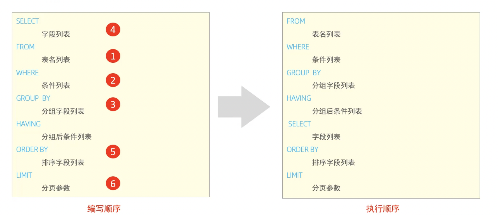
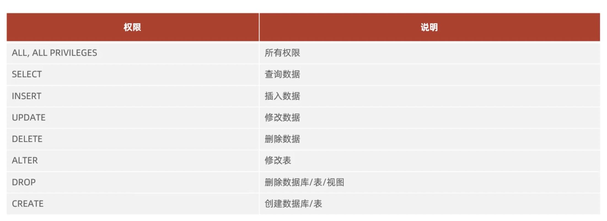

# Mysql Function Study

### SQL

#### SQL分类

| 分类  |             全称             |             说明              |
|:---:|:--------------------------:|:---------------------------:|
| DDL |  Data Definition Language  |    数据定义语言， 用来创建数据库，表，字段     |
| DML | Data Manipulation Language |      数据操作语言，用来对数据进行增删改      |
| DQL |    Data Query Language     |     数据查询语言，用来查询数据库中表的记录     |
| DCL |   Data Control Language    | 数据控制语言，用来创建数据库用户，控制数据库的访问权限 |

#### DDL语句

##### DDL 数据库操作

###### 查询

```sql
-- 查询所有数据库
SELECT DATABASES;
-- 查询当前数据库
SELECT DATABASE();
```

###### 创建

```sql
-- 创建数据库
CREATE DATABASE [IF NOT EXISTS] 数据库名 [DEFAULT CHARSET 字符集(utf8/utf8mb4)] [COLLATE 排序规则];
```

###### 删除

```sql
-- 删除数据库
DROP DATABASE [IF EXISTS] 数据库名;
```

###### 使用

```sql
USE 数据库名;
```

##### DDL 表操作

###### 查询

```sql
-- 查询当前数据库中所有表
SHOW TABLES;

-- 查询表结构
DESC 表名;

-- 查询指定表的建表语句
SHOW CREATE TABLE 表名;
```

###### 创建

```sql
-- 创建一个表
CREATE TABLE [ IF NOT EXISTS ] 表名(
			字段1 字段类型1 [COMMENT 字段1注释],
      字段2 字段类型2 [COMMENT 字段2注释],
      字段3 字段类型3 [COMMENT 字段3注释],
  		...
      字段n 字段类型n [COMMENT 字段n注释]
)[COMMENT 表注释];

-- 举例
CREATE TABLE IF NOT EXISTS person(
	id varchar(36) COMMENT 主键ID,
  name varchar(128) COMMENT 姓名,
  age bitint COMMENT 年龄,
  gender varchar(2) COMMENT 性别
)COMMENT 用户表;
```

###### 修改

```sql
-- 添加字段
ALTER TABLE 表名 ADD 字段名 类型(长度) [COMMENT 注释] [约束]; 

-- 修改字段类型
ALTER TABLE 表名 CHANGE 字段名 类型(长度) [COMMENT 注释] [约束];

-- 修改字段名 和 字段类型
ALTER TABLE 表名 CHANGE 旧字段名 新字段名 类型(长度) [COMMENT 注释] [约束];

-- 删除字段
ALTER TABLE 表名 DROP 字段名;

-- 修改表名
ALTER TABLE 表名 RENAME TO 新表名;
```

###### 删除

```sql
-- 删除表
DROP TABLE IF EXISTS 表名;

-- 删除表，并重新创建该表 (清除表中的数据)
TRUNCATE TABLE 表名;
```

###### 数据类型

1. 数值类型

   * **tinyint**：1 字节，-128~127（常用：0/1 状态）
   * **smallint**：2 字节
   * **mediumint**：3 字节
   * **int**：4 字节（最常用）
   * **bigint**：8 字节（订单 ID、用户 ID、超大数字）

   > 有无符号：`unsigned` 可让范围翻倍，如 int 0~42 亿

   * **float**：单精度浮点，4 字节（不精确）

   * **double**：双精度浮点，8 字节（较精确）

   * **decimal(M,D)**：**精确小数**，M 总位数，D 小数位  → 钱、金额必须用 `decimal`，禁止 float/double

2. 字符串类型

   * **char(n)**：固定长度字符串，n=0~255

     优点：快；缺点：浪费空间

   * **varchar(n)**：可变长度，更省空间（最常用）

   * **text**：大文本，存文章、内容

     - tinytext
     - text
     - mediumtext
     - longtext

   * **blob**：二进制大对象，存图片、文件（一般不推荐存数据库）

   * **enum**：枚举，如 enum ('male','female')

   * **set**：集合，可多选

3. 时间类型

   * **date**：日期，`YYYY-MM-DD`
   * **time**：时间，`HH:MM:SS`
   * **year**：年份
   * **datetime**：日期 + 时间 `YYYY-MM-DD HH:MM:SS`（常用）
   * **timestamp**：时间戳，自动时区转换，会随更新自动刷新 → 常用作 `create_time`、`update_time`

#### DML语句

##### 添加数据（INSERT）

```sql
-- 给指定字段添加数据
INSERT INTO 表名(字段名1, 字段名2, ... , 字段名n) VALUES （值1, 值2, ... , 值n）;

-- 给全部字段添加数据
INSERT INTO 表名 VALUES （值1, 值2, ... , 值n）;

-- 批量添加数据
INSERT INTO 表名(字段名1, 字段名2, ... , 字段名n) VALUES （值1, 值2, ... , 值n）,（值1, 值2, ... , 值n）,（值1, 值2, ... , 值n）... ,（值1, 值2, ... , 值n）;
INSERT INTO 表名 VALUES （值1, 值2, ... , 值n）,（值1, 值2, ... , 值n）,（值1, 值2, ... , 值n）, ... , （值1, 值2, ... , 值n）;
```

##### 修改数据（UPDATE）

```sql
UPDATE 表名 SET 字段1=值1, 字段2=值2, ... [WHERE 条件];
```

***注意：如果没有条件则会修改表中的所有数据。***

##### 删除数据（DELETE）

```sql
DELETE FROM 表名 [WHERE 条件]
```

***注意：如果没有条件则会修改表中的所有数据。***

#### DQL语句

查询关键字: ***SELECT***

```sql
SELECT 字段列表
FROM 表名列表
WHERE 条件列表
GROUP BY 分组列表
HAVING 分组后条件列表
ORDER BY 排序字段列表
LIMIT 分页参数
```

##### DQL 类别

###### 基本查询

```sql
-- 查询多个字段
SELECT 字段1, 字段2, ... , 字段n FROM 表名;

-- 查询所有字段
SELECT * FROM 表名;

-- 设置别名
SELECT 字段1 [AS 别名1] , 字段2 [AS 别名2], ... , 字段n [AS 别名n] FROM 表名;

-- 去除重复记录
SELECT DISTINCT 字段列表 FROM 表名;
```

###### 条件查询（ WHERE ）

```sql
SELECT 字段列表 FROM 表名 WHERE 条件列表;
```

**条件分类**

1. 比较条件

   * `=` 等于
   * `!=` 或 `<>` 不等于
   * `>` 大于
   * `<` 小于
   * `>=` 大于等于
   * `<=` 小于等于

2. 范围条件

   * `BETWEEN ... AND ...` 在区间内 (含最小值、最大值)

   * `NOT BETWEEN ... AND ...` 不在区间内

3. 集合匹配

   * `IN(值1,值2,...)` 在列表中
   * `NOT IN(...)` 不在列表中

4. 模糊查询（字符串）

   * `LIKE 'xxx%'` 以 xxx 开头
   * `LIKE '%xxx'` 以 xxx 结尾
   * `LIKE '%xxx%'` 包含 xxx
   * `NOT LIKE` 不匹配

5. 空值判断

   * `IS NULL` 为空
   * `IS NOT NULL` 不为空

6. 逻辑条件

   * `AND` 或者 `&&`  -->   并且（同时满足）
   * `OR`  或者 `||`   -- >  或者（满足其一）
   * `NOT` 或者 `!`  -->  取反

7. 其他常用

   * `EXISTS(子查询)` 子查询有结果则为真
   * `NOT EXISTS` 子查询无结果则为真

###### 聚合函数 （ COUNT, MAX, MIN, AVG, SUM, ...）

**将一列数据作为一个整体，进行纵向计算**

```sql
SELECT 聚合函数(字段列表) FROM 表名;

-- COUNT 统计数量，null值是不参与计算的
SELECT COUNT(字段列表) FROM 表名;

-- MAX 最大值
SELECT MAX(字段列表) FROM 表名;

-- MIN 最小值
SELECT MIN(字段列表) FROM 表名;

-- AVG 求平均值
SELECT AVG(字段列表) FROM 表名;

-- SUM 求和
SELECT SUM(字段列表) FROM 表名;
```

###### 分组查询（ GROUP BY）

```sql
SELECT 字段列表 FROM 表名 [WHERE 条件] GROUP BY 分组字段名 [HAVING 分组后的过滤条件];

-- eg: 查询年龄(age)小于45的员工，并根据工作地址(work_address)进行分组，获取员工数量大于等于3的工作地址;
SELECT work_address, COUNT(*) address_count FROM WHERE age < 45 GROUP BY work_address HAVING address_count >= 3;
```

**WHERE 和 HAVING 之间的区别**

1. **执行时机不同：** `WHERE` 是分组之前进行的过滤，不满足`WHERE`条件不进行分组，`HAVING`是分组之后对结果进行的过滤。
2. **判断条件不同:** `WHERE`不能对聚合函数进行判断，而`HAVING`可以。

**优先级：WHERE > GROUP BY > HAVING**

###### 排序查询（ ORDER BY ）

```sql
SELECT 字段列表 FROM 表名 ORDER BY 字段1 条件1, 字段2 条件2, ... , 字段n 条件n;
```

**排序方式**

1. 升序 ASC
2. 降序 DESC

**注意：多段排序，只有第一段排序相同时，才会进行第二段排序。**

###### 分页查询（ LIMIT ）

```sql
SELECT 字段列表 FROM 表名 LIMIT 起始索引 查询
```

**注意**

1. 起始索引从0开始，起始索引 = ( 查询页码 - 1 )  * 每页显示记录数。
2. 分页查询时数据库的方言，不同数据库，有不同的实现，`Mysql` 是 `LIMIT`。
3. 如果查询时第一页数据，起始索引可以省略，直接简写为 ` LIMIT 10`。

##### DQL 执行顺序



#### DCL语句

**DCL英文全称是Data Control Language(数据控制语言)，用来管理数据库用户、控制数据库的访问权限**

##### DCL管理用户

###### 查询用户

```sql
USE MYSQL;
SELECT * FROM USER;
```

###### 创建用户

```sql
CREATE USER '用户名'@'主机名' IDENTIFIED BY '密码';
```

###### 修改用户密码

```sql
ALTER USER '用户名'@'主机名' IDENTIFIED WITH MYSQL_NATIVE_PASSWORD BY '新密码';
```

###### 删除用户

```sql
DROP USER '用户名'@'主机名';
```

##### DCL控制权限

###### 控制权限类别

**权限描述及定义，查看[官方文档](https://dev.mysql.com/doc/refman/8.0/en/privileges-provided.html)**

**MySQL的常见权限，如下所示：**



###### 查询权限

```sql
SHOW GRANTS FOR '用户名'@'主机名';
```

###### 授予权限

```sql
GRANT 权限列表 ON 数据库.表名 TO '用户名'@'主机名';
```

###### 撤销权限

```sql
REVOKE 权限列表 ON 数据库.表名 FROM '用户名'@'主机名';
```

###### 注意

1. 多个权限之间，使用英文逗号分隔
2. 授权时，数据库名 和 表名 可以使用 * 进行通配，代表所有。

### 函数

**函数：是指一段可以直接被另一段程序调用的程序或代码**

#### sql语句

```sql
SELECT 函数;
```

#### 字符串函数

##### 类别

|             函数             |                  功能                  |
|:--------------------------:|:------------------------------------:|
|  CONCAT(s1, s2, ... ,sn)   |  字符串拼接，将 s1, s2, ... , sn 拼接成一个字符串   |
|         LOWER(str)         |              将字符串全部转成小写              |
|         UPPER(str)         |              将字符串全部转成大写              |
|     LPAD(str, n, pad)      | 左填充，用字符串pad对应字符串左边str进行填充，达到n个字符串的长度 |
|     RPAD(str, n, pad)      | 右填充，用字符串pad对应字符串右边str进行填充，达到n个字符串的长度 |
|         TRIM(str)          |            去除字符串头部和尾部的空格             |
| SUSSTRING(str, start, len) |     返回字符串str从start位置起的len长度的字符串      |

#### 数值函数

##### 类别

|     函数      |         功能         |
|:-----------:|:------------------:|
|   CEIL(x)   |        向上取整        |
|  FLOOR(x)   |        向下取整        |
|  MOD(x, y)  |    返回 x / y 的模     |
|    RAND     |     返回0～1内的随机数     |
| ROUND(x, y) | 求参数x的四舍五入的值，保留y位小数 |

#### 日期函数

##### 类别

|                 函数                 |              功能              |
|:----------------------------------:|:----------------------------:|
|             CURDATE()              |            返回当前日期            |
|             CURTIME()              |            返回当前时间            |
|               NOW()                |          返回当前日期和时间           |
|             YEAR(date)             |         获取指定date的年份          |
|            MONTH(date)             |         获取指定date的月份          |
|             DAY(date)              |         获取指定date的日期          |
| DATE_ADD(date, INTERVAL expr type) | 返回一个日期/时间值加上一个时间间隔expr之后的时间值 |
|       DATEDIFF(date1, date2)       |  返回起始时间date1和结束时间date2之间的天数  |

#### 流程函数

##### 类别

|                               函数                               |                     功能                     |
|:--------------------------------------------------------------:|:------------------------------------------:|
|                        IF(value, t, f)                         |           如果value为true，返回t，否则返回f           |
|                     IFNULL(value1,value2)                      |      如果value1不为空，返回value1，否则返回value2       |
|     CASE WHEN [val1] THEN [res1] .... ELSE [ default ] END     |  如果val1为true，返回res1，... ，否则返回default默认值值   |
| CASE [expr] WHEN  [val1] THEN [res1] .... ELSE [ default ] END | 如果expr的值等于val1，返回res1，... ，否则返回default默认值值 |

### 约束

#### **概念**

**约束是作用于表中的字段上的规则，用于限制存储在表中的数据。概念：约束是作用于表中的字段上的规则，用于限制存储在表中的数据。**

#### **目的**

**保证数据库中数据的正确，有效性和完整性。**

#### 分类

|  约束  |              描述              |     关键字     |
|:----:|:----------------------------:|:-----------:|
| 非空约束 |         限制该字段不能为NULL         |  NOT NULL   |
| 唯一约束 |     保证该字段的所有字段都是唯一的，不重复的     |   UNIQUE    |
| 主键约束 |     主键是一行数据的唯一标识，要求非空且唯一     | PRIMARY KEY |
| 默认约束 |   保存数据时，如果未指定该字段的值，则采用默认值    |   DEFAULT   |
| 检查约束 |         保证字段值满足某一个条件         |    CHECK    |
| 外键约束 | 用来让两张表的数据之间建立连接，保证数据的唯一性和完整性 | FOREIGN KEY |

#### 外键约束

**外键用来让两张表的数据之间建立连接，从而保证数据的一致性和完整性。**

##### 约束

```sql
-- 添加外键
ALTER TABLE 表名 ADD CONSTRAINT 外键名称 FOREIGN KEY (外键字段名) REFERENCES 主表(主表列名);

-- eg:主表 部门表 dept.id, 从表 user.dept_id
ALTER TABLE user ADD CONSTRAINT fk_emp_dept_id FOREIGN KEY (dept_id) REFERENCES dept(id);

-- 删除外键
ALTER TABLE 表名 DROP FOREIGN KEY 外键名称;

-- eg: 删除 user 表中的 fk_emp_dept_id 外键
ALTER TABLE user DROP FOREIGN KEY fk_emp_dept_id;
```

##### 删除/更新行为

|     行为      |                                说明                                |
|:-----------:|:----------------------------------------------------------------:|
|  NO ACTION  |      当父表中删除/更新对应记录时，首先检查该记录是否有对应外键，如果有则不允许删除/更新（与RETRICT一致）      |
|   RETRICT   |    当父表中删除/更新对应记录时，首先检查该记录是否有对应外键，如果有则不允许删除/更新（与NOT ACTION一致）     |
|   CASCADE   |        当父表中删除/更新对应记录时，首先检查该记录是否有对应外键，如果有，则也删除/更新外键在子表的记录。        |
|  SET NULL   | 当在父表中删除对应记录时，首先检查该记录是否有对应外键，如果有则设置子表中该外键值为null。（这就要求该外键允许取null）。 |
| SET DEFAULT |                父表有变更时，子表将外键列设置成一个默认的值(Innodb不支持)。                |

```sql
-- 添加行为
ALTER TABLE 表名 ADD CONSTRAINT 外键名称 FOREIGN KEY (外键字段名) REFERENCES 主表(主表列名) ON UPDATE CASCADE ON DELETE CASCADE;

-- -- eg:主表 部门表 dept.id, 从表 user.dept_id 并添加 CASCADE 行为
ALTER TABLE user ADD CONSTRAINT fk_emp_dept_id FOREIGN KEY (dept_id) REFERENCES dept(id) ON UPDATE CASCADE ON DELETE CASCADE;
```

### 多表查询

#### 多表关系

##### 一对多/多对一

* **案列：**部门 与 员工的关系。
* **关系：**一个部门对应多个员工，一个员工对应一个部门。
* **实现：**在多的一方创建外键，指向一的一方的主键。

##### 多对多

* **案列：**学生 与 课程的关系。
* **关系：**一名学生可以选择多门课程，一门课程可以有多名学生。
* **实现：**建立第三张表，中间表至少包含两个外键，分别关联两方主键。

##### 一对一

* **案列：**用户 与 用户详情的关系。
* **关系：**一对一关系，多用于单表拆分，将一张表的基础字段放在一张表中，其他详情字段放在另一张表中，以提示操作效率。
* **实现：** 在任意一方加上外键，关联另一方主键，并设置外键唯一的约束(UNIQUE)。

#### 多表查询概述

* **概述：**指从多张表中查询数据。
* **笛卡尔集：**笛卡尔乘集是指在数学中，两个集合 A集合 和 B集合的所有组合情况。（在多表查询的时候，需要消除无效的笛卡尔集。）

```sql
-- eg: 一对一/一对多， 部门dept.id，人员user.dept_id
SELECT * FROM user, dept WHERE dept.id = user.dept_id;

-- eg: 多对多，课程course.id, 学生student.id，学生课程关系表student_course(id, student_id, course_id)
SELECT * FROM course, student, student_course WHERE student_course.student_id = student.id && student_course.course_id = course.id;
```

#### 多表查询的分类

##### 内连接

**相当于查询A、B交集的部分数据**

* 隐式内连接

  ```sql
  SELECT 字段列表 FROM 表1，表2 WHERE 条件;
  
  -- 查询每一个员工姓名，及关联的部门的名称
  SELECT user.name, dept.name FROM user, dept WHERE user.dept_id = dept.id;
  ```

* 显式内连接：

  ```sql
  SELECT 字段列表 FROM 表1 [INNER] JOIN 表2 ON 连接条件 ...;
  
  -- 查询每一个员工姓名，及关联的部门的名称
  SELECT user.name, dept.name FROM user [INNER] JOIN dept ON user.dept_id = dept.id;
  ```

##### 外连接

* **左外连接：**查询左表所有数据，以及两张表交集的部分数据。

  ```sql
  SELECT 字段列表 FROM 表1 LEFT [OUTER] JOIN 表2 ON 连接条件 ...;
  
  -- 查询员工表中的所有数据，和对应的部门的信息;
  SELECT user.*, dept.name FROM user LEFT [OUTER] JOIN dept ON user.dept_id = dept.id;
  ```

* **右外连接：**查询右表所有数据，以及两张表交集的部分数据。

  ```sql
  SELECT 字段列表 FROM 表1 RIGHT [OUTER] JOIN 表2 ON 连接条件 ...;
  
  -- 查询部门表中的所有数据，和员工的信息;
  SELECT user.*, dept.* FROM user RIGHT [OUTER] JOIN dept ON user.dept_id = dept.id;
  ```

##### 自连接

**当前表与自身的连接查询，自连接必须使用表别名。**

```sql
-- 自连接查询，可以是内连接查询，也可以是外连接查询。
SELECT 字段列表 FROM 表A 别名A JOIN 表A 别名B ON 连接条件 ...;

-- 查询员工及其领导的名字 emp.id, emp.name, emp.managerid
SELECT emp1.name, emp2.name FROM emp emp1 JOIN emp emp2 ON emp1.managerid == emp2.id;

-- 查询员工及其领导的名字 emp.id, emp.name, emp.managerid，如果员工没有领导，也要查询出来。
SELECT emp1.name '员工', emp2.name 上级 FROM emp1 LEFT JOIN emp emp2 ON emp1.managerid == emp2.id;
```

#### 联合查询

**对于UNION查询，就是把多次查询的结果合并起来，形成一个新的查询结果集。**

```sql
SELECT 字段列表 FROM 表A ...
UNION [ALL]
SELECT 字段列表 FROM 表B ...;

-- 薪资低于5千，年龄大于50, emp.salary 和 emp.age;
SELECT * FROM emp WHERE emp.salary < 5000
UNION ALL
SELECT * FROM emp WHERE emp.age > 50;

-- 去重查询：薪资低于5千，年龄大于50, emp.salary 和 emp.age;
SELECT * FROM emp WHERE emp.salary < 5000
UNION
SELECT * FROM emp WHERE emp.age > 50;
```

**注意**

1. 对于联合查询的多张表的列数必须保持一致，字段类型也需要保持一致。
2. `UNION ALL` 会将全部的数据直接合并在一起，`UNION` 会对合并之后的数据去重。 

#### 子查询

**概念：SQL语句中嵌套SELECT语句，称为嵌套查询，又称子查询。**

```sql
SELECT 字段列表 FROM 表1 WHERE 字段 = (SELECT 字段 FROM 表2 );
```

***子查询外部的语句可以是INSERT/UPDATE/DELETE/SELECT的任何一个。***

##### 子查询结果分类

###### 标量子查询 (子查询结果为单个值)

**子查询返回的结果是单个值（数字，字符串，日期等），最简单的形式，这种子查询称为标量子查询。**

**常用的操作符：**=、<>、>、 >=、 <、 <=

```sql
-- 查询“销售部”的所有员工信息
SELECT * FROM emp WHERE emp.deptid = (SELECT id FROM dept WHERE name = '销售部');

-- 查询在“东方白”入职之后的员工信息
SELECT * FROM emp WHERE entrydate > (SELECT entrydate FROM emp WHERE name = '东方白');
```

###### 列子查询（子查询结果为一列）

**子查询返回的结 果是一列（可以是多列），这种子查询称为列子查询。**

**常用的操作符：**`IN`,  `NOT IN`, `ANY`, `SOME`, `ALL`

|  操作符   |            描述            |
|:------:|:------------------------:|
|   IN   |      在指定的集合范围之内，多选一      |
| NOT IN |       不在制定的集合范围之内        |
|  ANY   |    子查询返回列表中，有任意一个满足即可    |
|  SOME  | 与ANY等同，使用SOME的地方都可以使用ANY |
|  ALL   |     子查询返回列表的所有值都必须满足     |

```sql
-- 列子查询
-- 查询 销售部 和 市场部 的所有员工信息
SELECT * FROM emp WHERE dept_id IN (SELECT id FROM dept WHERE name IN ('销售部', '市场部'));

-- 查询比财务部所有人工资都高的员工信息
SELECT * FROM emp WHERE salary > ALL (SELECT salray FROM emp WHERE dept_id = (SELECT id FROM dept WHERE name = '财务部'));

-- 查询比研发部其中任意一人工资高的员工信息
SELECT * FROM emp WHERE salary > ANY (SELECT salray FROM emp WHERE dept_id = (SELECT id FROM dept WHERE name = '研发部'));
```

###### 行子查询（子查询结果为一行）

**子查询返回的结果是一行（可以是多行），这种子查询称为列子查询。**

**常用的操作符:** `=`, `<>`, `IN`, `NOT IN`

```sql
-- 行子查询
-- 查询与 “张无忌” 的薪资及直属领导相同的员工信息；
SELECT * FROM emp WHERE (salary, superior) = (SELECT salary, superior FROM emp WHERE name = '张无忌');
```

###### 表子查询（子查询结果为多行多列）

**子查询返回结果是多行多列，这种子查询称为*表子查询***

**常用的操作符:** `IN`

```sql
-- 表子查询
-- 查询与 "鹿杖客", "宋远桥" 的职位和薪资相同的员工信息
SELECT * FROM emp WHERE (position, salary) in (SELECT position, salary FROM emp WHERE name = '宋远桥' OR name = '鹿杖客');

-- 查询入职日期是 "2006-01-01" 之后的员工信息，及其部门信息
SELECT e.*, d.* FROM (SELECT * FROM emp WHERE entrydate > '2006-01-01') e LEFT JOIN dept d on e.dept_id = d.id;
```

##### 子查询位置分类

###### WHERE之后

```sql
-- 查询与 "鹿杖客", "宋远桥" 的职位和薪资相同的员工信息
SELECT * FROM emp WHERE (position, salary) in (SELECT position, salary FROM emp WHERE name = '宋远桥' OR name = '鹿杖客');
```

###### FROM之后

```sql
-- 查询入职日期是 "2006-01-01" 之后的员工信息，及其部门信息
SELECT e.*, d.* FROM (SELECT * FROM emp WHERE entrydate > '2006-01-01') e LEFT JOIN dept d on e.dept_id = d.id;
```

###### SELECT之后

```sql
-- 查询低于本部门平均薪资的员工信息 和 部门的平均薪资
SELECT *, (SELECT AVG(salary) FROM emp e1 WHERE e1.dept_id = e2.dept_id) FROM emp e2 WHERE salary < (SELECT AVG(salary) FROM emp e1 WHERE e1.dept_id = e2.dept_id);
```

## 事务

### 事务简介

***事务* 是一组操作的集合，它是一个不可分割的工作单位，事务会把所有的操作作为一个整体一起向系统提交或撤销操作请求，即这些操作*要么同时成功，要么同时失败*。**

默认MySQL的事务是自动提交的，也就是说，当执行一条DML语句，MySQL会立刻隐式的提交事务。

### 事务操作

#### 查看/设置事务提交方式

```sql
SELECT @@AUTOCOMMIT;
SET @@AUTOCOMMIT = 0;
```

#### 开启事务

```sql
-- 开始事务的两种方式
START TRANSACTION;
BEGIN;
```

#### 提交事务

```sql
COMMIT;
```

#### 回滚事务

```sql
ROLLBACK;
```

### 事务四大特性  

* **原子性（Atomicity）**：事务是不可分割的最小操作单元，要么全部成功，要么全部失败。
* **一致性（Consistency）**：事务提交完成时，必须使所有的数据都保持一致状态。
* **隔离性（Isolation）**：数据库系统提供的隔离机制，保证事务在不受外部并发操作影响的独立环境下运行。
* **持久性（Durability）**：事务一旦提交或回滚，它对数据库中的数据的改变就是永久的。

### 并发事务问题

|  问题   |                           描述                           |
|:-----:|:------------------------------------------------------:|
|  脏读   |                  一个事务读到另一个事务还没有提交的数据。                  |
| 不可重复读 |           一个事务先后读取同一条记录，但两次读取的数据不同，称之为不可重复读。           |
|  幻读   | 一个事务按照条件查询数据时，没有对应的数据行，但是在插入数据时，又发现这行数据已经存在了，好像出现了“幻影” |

### 事务隔离级别

|  隔离级别(Y-出现,N-不出现)   | 描述 | 不可重复读 | 幻读 |
|:-------------------:|:--:|:-----:|:--:|
|  Read uncommitted   | Y  |   Y   | Y  |
|   Read committed    | N  |   Y   | Y  |
| Repeatable Read(默认) | N  |   N   | Y  |
|    Serializable     | N  |   N   | N  |

```sql
-- 查看事务的隔离级别
SELECT @@TRANSACTION_ISOLATION;

-- 设置事务隔离级别 SESSION - 会话, GLOBAL - 全 局
SET [SESSION | GLOBAL] TRANSACTION ISOLATION LEVEL { READ UNCOMMITTED | READ COMMITTED | REPEATABLE READ | SERIALIZABLE};
```

***注意: 事务隔离级别越高，数据越安全，但是性能越低。***
